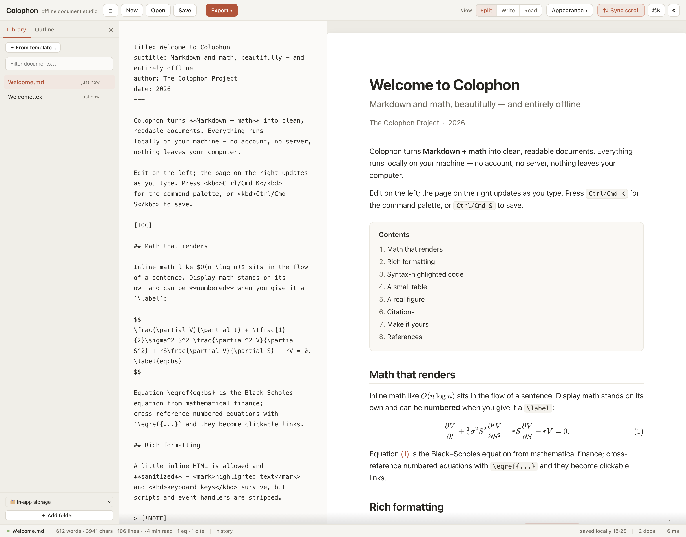
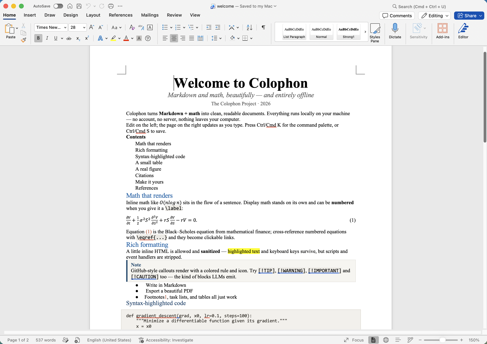

# Colophon

**A private, fully-offline document studio for technical Markdown.** Write Markdown with math —
or paste it straight from an LLM — see it typeset live, and export paper-quality PDF, HTML,
LaTeX, or a Word file whose equations arrive **native and editable**, not as images.

One HTML file. No install, no account, no server, no telemetry. Nothing you write ever leaves
your machine.

**[⬇ Download colophon.html](https://github.com/Azy02/Colophon/releases/latest/download/colophon.html)** · [Landing page](https://azy02.github.io/Colophon/) · MIT license



## Why it exists

Technical documents keep dying in the same two places: tools that round-trip your text through
someone's server (a non-starter for unpublished work), and exports that turn every equation into
an image — or garbage — on the way to Word. Colophon is built against both:

- **Math that survives Word.** Equations are converted KaTeX → MathML → OMML, the format Word's
  own equation editor uses. Your collaborators can click into an equation and keep editing it.
  Verified by opening real exports in real Microsoft Word.

  

- **Private by construction.** The app is one local HTML file that makes zero network requests.
  Remote images in documents are blocked by default, so a pasted document can't phone home
  either. Exported HTML carries a strict Content-Security-Policy and no scripts. The application
  code ships unminified on purpose — the privacy claims are checkable by reading the file you run.

- **Your files, your folders.** Link a folder and it becomes a project: documents are plain `.md`
  files on your disk, pasted images land in `figs/`, everything works with git, Dropbox, or a
  plain backup. No import, no lock-in. (Browser storage remains as a zero-setup fallback.)

## Features

- Live split-pane editing with KaTeX math — including the `\(…\)` / `\[…\]` delimiters LLMs emit,
  equation numbering, `\label`/`\eqref` cross-references
- Exports: PDF (print-quality page breaks), standalone HTML (script-free, CSP-locked), Word
  `.docx` with native OMML equations, LaTeX `.tex`, Markdown — plus "Copy for Word" straight to
  the clipboard
- LaTeX import: open a `.tex` file, get an offered Markdown conversion with the math passed
  through untouched
- BibTeX citations (numeric or author–year) with an auto-built reference list
- Mermaid diagrams (rendered locally; exported as crisp images), figures with captions,
  numbering, and cross-references
- Footnotes, GitHub-style callouts, task lists, syntax-highlighted code
- Three paper themes × three document styles, autosave, version history, command palette (⌘K)

## Quick start

1. Download `colophon.html` (one file, ~7 MB — KaTeX's math fonts are embedded so math works
   offline).
2. Open it in a modern browser. Works from your Downloads folder, a USB stick, or an air-gapped
   machine.
3. Write, or paste. To work on real files, link a folder (Chromium-family browsers).

## Build from source

```bash
npm install
npm test        # 213 tests, node --test
npm run build   # emits dist/Colophon.html
```

The build is a plain esbuild bundle (`build.mjs`); the application source stays readable in the
output on purpose.

## Honest limitations

- Folder linking uses the File System Access API, which Safari and Firefox have declined to
  implement — outside Chromium you get in-app storage and `.md` export instead.
- PDF export uses the browser's print dialog; page numbering is most reliable in Chromium.
- Every render and export path passes through a single sanitization gate (DOMPurify), covered by
  an XSS test gauntlet — but as with any tool that renders pasted HTML, treat documents from
  untrusted sources with the same care you'd give any file.

## The name

A *colophon* is the finishing mark of a well-made book — the note at the end that says how it
was made. Fitting, for the finishing touch on your documents.

## License

[MIT](LICENSE) © 2026 Zhiyang An. If there's real demand for a native app (file associations,
one-click PDF, a menu bar), that's the roadmap — open an issue and say so.
